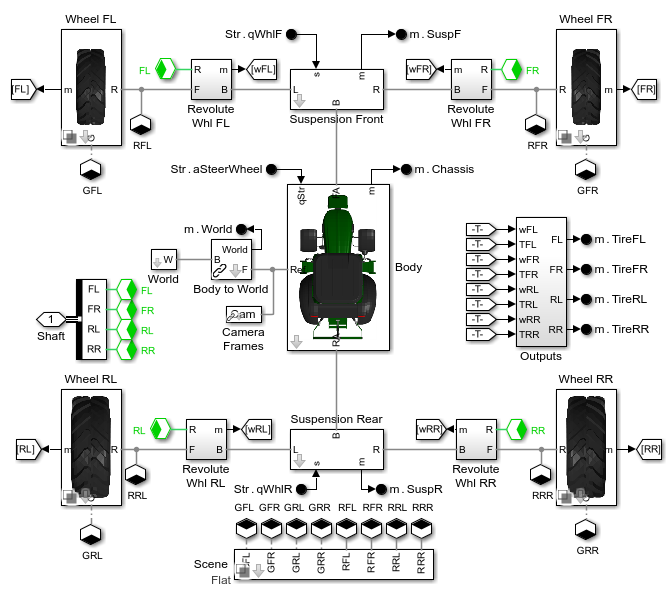

# **Row Crop Tractor with Simscape&trade;**

This example models a tractor with configurable four wheel steering 
that can drive on flat and uneven terrain.  You can configure driver inputs, 
scene where the tractor is driving, and the maneuver.

The **[Simscape Multibody Tire Model](https://www.mathworks.com/help/physmod/sm/ref/magicformulatireforceandtorque.html)** is tested under various conditions:

* **Step Steer Maneuver** to test lateral dynamics
* **Traversing a Plateau** to test the effect of road slope 
* **Rough Road** to show road definitions using surface data in MATLAB
* **Orchard** to test driving on uneven terrain 

Open the project file Tractor_Row_Crop_Simscape.prj to get started.

**Acknowledgements**: MathWorks would like to thank 
* M V Krishna Teja, PhD, [Virtual Proving Ground and Simulation Lab](https://prof-rkkumar.wixsite.com/iitm-vpg-lab), 
Raghupati Singhania Centre of Excellence at the Indian Institute of Technology, 
Madras for providing the tire parameters for this example.
* Magna Powertrain, Digitrans, Joanneum Research Digital, and Persival for providing
the data used to create the uneven road surface.  Please see [ASAM OpenX standards in offroad
applications](https://www.asam.net/index.php?eID=dumpFile&t=f&f=9465&token=cce8826db1a1c3b095de0fc2b60db820b76ec338) 
for more information.

## **Tractor Animation Clip**

## **Model Overview**

## **Vehicle Model**

## **Tire Model**

To learn more about modeling and simulation with Simscape, please visit:
* [Simscape Vehicle Templates](https://www.mathworks.com/solutions/physical-modeling/heavy-equipment.html)
* See also:
   * [Simscape&trade;](https://www.mathworks.com/products/simscape.html)
   * [Simscape Battery&trade;](https://www.mathworks.com/products/simscape-battery.html)
   * [Simscape Driveline&trade;](https://www.mathworks.com/products/simscape-driveline.html)
   * [Simscape Electrical&trade;](https://www.mathworks.com/products/simscape-electrical.html)
   * [Simscape Fluids&trade;](https://www.mathworks.com/products/simscape-fluids.html)
   * [Simscape Multibody&trade;](https://www.mathworks.com/products/simscape-multibody.html)
